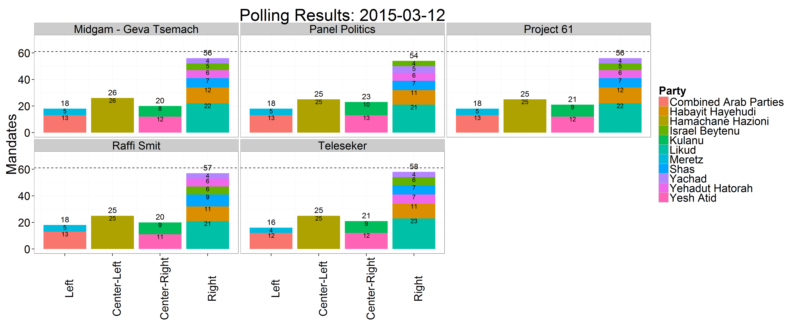
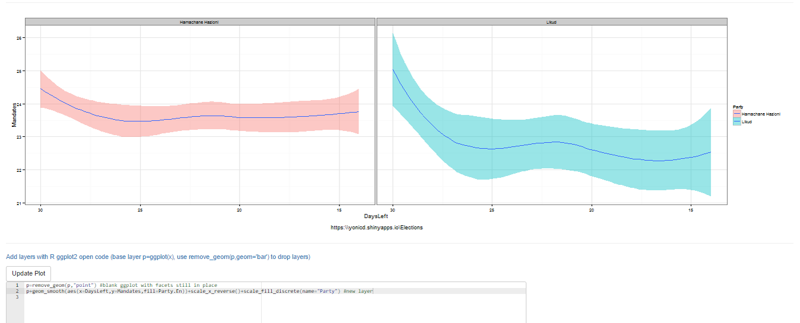
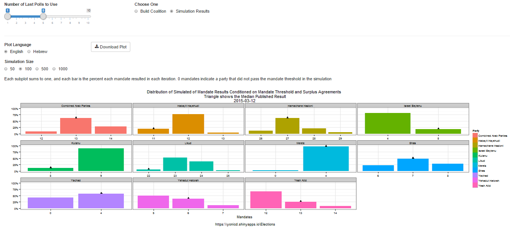

###The Israel Election Polls Analysis Depot is an interactive web application for analysing the elections in Israel powered by the [Shiny library of RStudio](http://shiny.rstudio.com/) and realtime published polling data from the [Project 61](http://infomeyda.com/) database.

####The App can be found on the [shiny servers](https://yonicd.shinyapps.io/Elections) or can be run through github

```r
runGitHub("Elections","yonicd")
```

####Application Layout:
1. [Election PAD](#C1)
2. [Election Analyis](#C2)
3. [Mandate Simulator and Coalition Whiteboard](#C3)
4. [Polling Database](#C4)

####Usage Intsructions:
1. <a=name="C1"></a>Election PAD
  * The latest polling day results published in the media and the prediction made using the Project 61 weighting schemes. The parties are stacked into blocks to see which block has best chance to create a coalition.



The Project 61 prediction is based past pollster error deriving weights from the 2003,2006,2009 and 2013 elections, dependant on days to elections and parties. In their [site](http://shiny.rstudio.com/) there is an extensive analysis on pollster bias towards certain parties and party blocks.
  
2. <a=name="C2"></a>Election Analyis
  * An interactive polling analysis layout where the user can filter elections, parties, publishers and pollster, dates and create different types of plots using any variable as 
the x and y axis.


The user can choose to include in the plots Elections (2003,2006,2009,2013,2015) and the subsequent filters are populated with the relevant parties, pollsters and publishers relevant to the chosen elections. Next there is a slider to choose the days before the election you want to view in the plot. This was used instead of a calendar to make a uniform timeline when comparing across elections.

In addition the plot itself is a ggplot thus the options above the graph give the user control on nearly all the options to build a plot. The user can choose from the following variables:

  * Party charactericts
    * Party, Ideology (Left, Left Center, Right, Right Center), Ideology.Group (Left, Right) ,Attribute (if party is old/new/split/merge compared to last election)
  * Time charactericts
    * Election, DaysLeft, Date, week, month, year, 
  * Poll charactericts
    * Publisher, Pollster
  * Results charactericts
    * Mandates, Mandate.Group, Results, Error (Pollster Error)

To define the following plot attributes:

  * X axis variable
  * X axis attributes: 
  * Discrete/Continuous, Rotation of X tick labels
  * Y axis Variable
  * Grouping
    * Split Y by colors using a different variable (can be also X or Y)
    * Create Facets to display subsets of the data in different panels (two more variables to cut data)
      * Type of facets: 
        * Wrap: Wrap 1d ribbon of panels into 2d
        * Grid: Layout panels in a grid (matrix)
      * Choose the variable to be the row dimension and another variable to be the column dimension

An example of filtering parties in the 2015 elections:


An example of comparing distribution polling errors by day to election and party blocks


  * If you are an R user and know ggplot there is an additional editor console,below the plot, where you can create advanced plots freehand, just add to the final object from the gui called p and the data.frame is x, eg p+geom_point(). Just notice that all aesthetics must be given they are not defined in the orginal ggplot() definition. It is also possible to use any library you want just add it to the top of the code, the end object must be a ggplot.


  * You can also remove the original layer if you want using the function remove_geom(ggplot_object,geom_layer), eg p=p+remove_geom(p,"point") will remove the geom_point layer in the original graph


  * Finally the plots can be viewed in english or hebrew, and can be downloaded to you local computer using the download button.

  
3. <a=name="C3"></a>Mandate Simulator and Coalition Whiteboard
  * A bootstrap simulation is run on Polling results from up to 10 of the latest polls using the sampling error as the uncertainty of each mandate published. Taking into account mandate surplus agreements using the [Hagenbach-Bischoff quota method](http://en.wikipedia.org/wiki/Hagenbach-Bischoff_quota) and the mandate threshold limit (in this election it is 4 mandates), calculating the simulated final tally of mandates. The distributions are plotted per party and the location of the median published results in the media.View the simulation results by checking the "View Simulation Results checkbox".
  * The user can choose how many polls to take into account, up to last 10 polls, and how big a simulation they want to run: 50,100,500,1000 random polling results per each party and poll.



  * Once the simulator is complete you can create coalitions based on either the simulated distribution or actual published polls and see who can pass 60 mandates. Choose the coalition parties and the opposition parties from dropdown lists. (Yes the ones chosen are non-sensicle on purpose...)


4. <a=name="C4"></a>Polling Database
  * All raw data used in the application can be viewed and filtered in a datatable.
  
